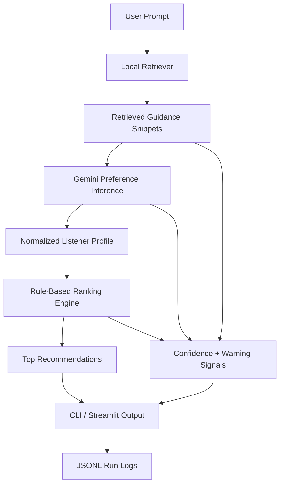

# System Architecture

```mermaid
flowchart TD
    A["User Prompt"] --> B["Local Retriever"]
    B --> C["Retrieved Guidance Snippets"]
    C --> D["Gemini Preference Inference"]
    D --> E["Normalized Listener Profile"]
    E --> F["Rule-Based Ranking Engine"]
    F --> G["Top Recommendations"]
    C --> H["Confidence + Warning Signals"]
    D --> H
    F --> H
    G --> I["CLI / Streamlit Output"]
    H --> I
    I --> J["JSONL Run Logs"]
```

This diagram is the source artifact for the final project README and portfolio screenshots.
